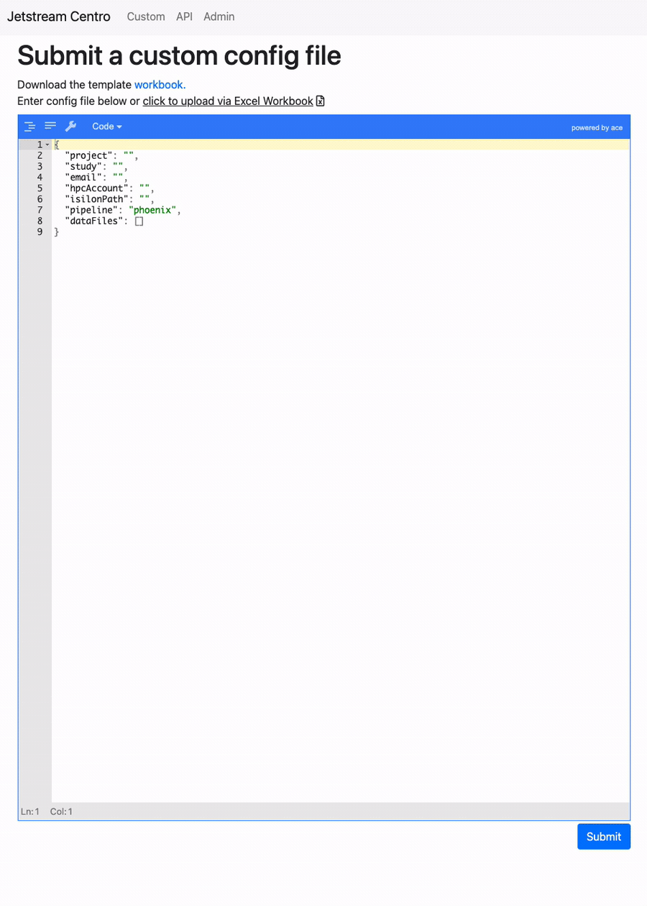
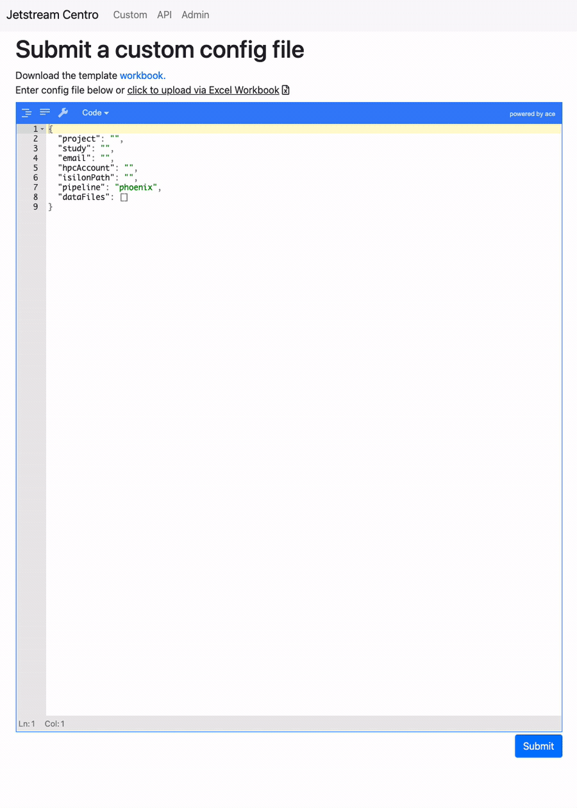

################
Jetstream Centro
################

**Jetstream Centro** is a django based webserver that allows pipelines to be
hosted and run as a centralized service. It includes a front-end with a run
submission page and utilizes a REST API for backend communication.

.. _deployment:

**********
Deployment
**********

1. Setup MySQL(MariaDB) server, create database and user.

  This is not documented here
  and should probably be left to the HPC/devops department. Just make sure that there
  is a user `jetstreamuser` who can create tables on the database `jetstream` these
  names can also be changed in the `secrets.json` file.

2. Cloned repo into home directory and checked out develop branch

  .. code-block:: console

    [~]$ git clone https://github.com/tgen/jetstream_centro.git
    [~]$ git checkout develop

  Alternatively, the project could be downloaded from a release.

3. Create a virtual environment. Note the ``--clear`` flag which will give us
   and empty venv without any packages installed.

  .. code-block:: console

     [~]$ cd jetstream_centro/
     [~/jetstream_centro]$ module load python/3.6.0
     [~/jetstream_centro]$ virtualenv venv --clear

  **WARNING**: You likely need to log out of the current session and then start a fresh session to prevent the full module from carrying forward

4. Source the virtual environment and install requirements. After sourcing the
   virtual environment your prompt should be prefixed with the environment name.

  .. code-block:: console

     [~]$ cd jetstream_centro/
     [~/jetstream_centro]$ source venv/bin/activate
     (venv)[~/jetstream_centro]$ pip3 install -r requirements.txt

5. Start the processes

  This step can be done many ways. It is preferred to use `PM2 <http://pm2.keymetrics.io>`_, a
  utility for managing long running processes. There are four processes we need to start
  total. The easiest way to do this is the included bash script, but it requires PM2.
  **WARNING**: PM2 requires nodeJS,

  .. code-block:: console

     (venv) [~/jetstream_centro]$ module load Nodejs/8.9.1
     (venv) [~/jetstream_centro]$ bash start.sh

  If you are not using pm2, here are the four processes that need to be started. You can
  look at the bash scripts to get more details on each one of the processes:

  .. code-block:: console

     (venv) [~/jetstream_centro]$ ~/bin/redis-server -- redis.conf
     (venv) [~/jetstream_centro]$ bash start_server.sh
     (venv) [~/jetstream_centro]$ bash start_worker.sh
     (venv) [~/jetstream_centro]$ bash start_beat.sh

.. _usage:

*****
Usage
*****

This usage guide assumes we already know how to generate config.json files for
use by the respective pipeline in the submission and have an understanding of
what fields are required. For more info on what these json files look like,
please check the :doc:`Jetstream usage documentation </usage>`.

Submission Methods
==================

Web GUI Submission
------------------

The web GUI hosts a ``custom`` page. On this page there is a text field with syntax
checks to make the json is formatted appropriately. If we already have a json ready,
then we can simply paste the completed json. Otherwise, we can use the template
:download:`workbook <https://github.com/tgen/jetstream_centro/raw/master/pipeline_management/static/pipeline_management/Phoenix-ProjectSetup_v1.0.xlsx>`.

**Copy-Paste submission example:**

**Excel sheet submssion example:**

Curl API Submission
-------------------

Jetstream Centro also supports REST API based submissions, we get a small preview of
this on the API page. Using ``curl`` we can post json submissions directly to the
server from the CLI.

This is very useful in the case where we have multiple jsons already generated or
if we would like perform submissions in a scripted manner. To get started, we have
two options:

User credentials over CLI
^^^^^^^^^^^^^^^^^^^^^^^^^

.. code-block:: console

  $ curl --request POST --user 'username:password' --header "Content-type: application/json" -d @example.json http://jetstream.centro.host.url:8000/api/v1/new-run/

Let's break down the different options:

- ``--request POST`` tells the API that we would like to post/add a new run.
- ``--user 'username:password'`` user credentials of the user submitting the new run, we wrap this
  in single quotes to avoid bash expansion/interpretation.
- ``--header "Content-type: application/json"`` defines the content type we are posting.
- ``-d @example.json`` path to the submission json.
- ``http://jetstream.centro.host.url:8000/api/v1/new-run/`` url address of where jetstream centro
  is hosted. Can be anything, and the port might be something other than 8000.

Use netrc-file
^^^^^^^^^^^^^^

Passing username and password over CLI is bad practice, instead, if using curl >= 7.21.5 then you should
consider using ``--netrc-file <filename>``. To do so we need to create a file with the following formatting:

.. code-block::

  machine jetstream.centro.host.url
  login <username>
  password <password>

This can be placed anywhere, but it makes sense to put it close to the user home directory.
Also with respect to security, make sure it is only read/write by your user, for instance use
``chmod 600 ~/path/to/centro.netrc``. Check out this helpful `.netrc documentation
<https://everything.curl.dev/usingcurl/netrc>`_ for more info on netrc with respect to curl.

In this case, the command would be similar to as follows:

.. code-block:: console

  $ curl --request POST --netrc-file ~/path/to/centro.netrc --header "Content-type: application/json" -d @example.json http://jetstream.centro.host.url:8000/api/v1/new-run/

Breaking down the different options:

- ``--request POST`` tells the API that we would like to post/add a new run.
- ``--netrc-file ~/path/to/centro.netrc`` netrc file we created earlier, contains user credentials.
- ``--header "Content-type: application/json"`` defines the content type we are posting.
- ``-d @example.json`` path to the submission json.
- ``http://jetstream.centro.host.url:8000/api/v1/new-run/`` url address of where jetstream centro
  is hosted. Can be anything, and the port might be something other than 8000.
