***************
Quality Control
***************

QC All
======

Samtools Stats
--------------

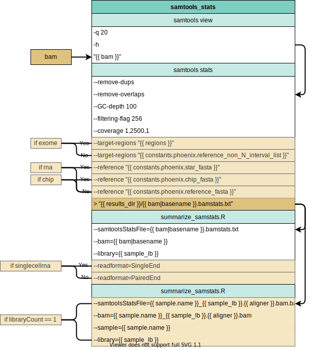

Samtools Markdup Stats
----------------------

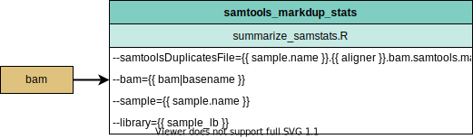

Samtools Flagstats
------------------

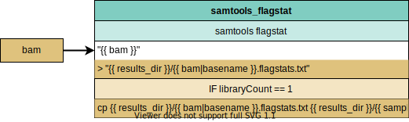

Samtools Idxstats
-----------------

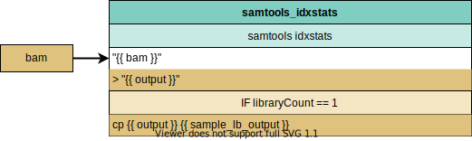

GATK CollectMultipleMetrics
---------------------------

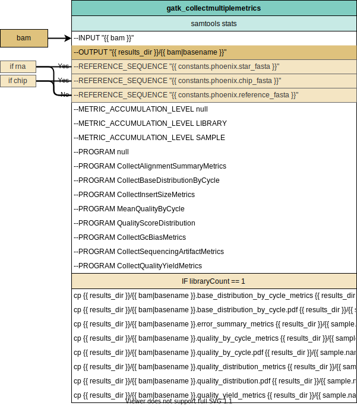

GATK ConvertSequencingArtifactToOxog
------------------------------------

.. figure:: QC_bam_qc_gatk_convertsequencingarrtifacttooxog.svg

SnpSniffer Genotyping
---------------------

.. figure:: QC_bam_qc_snpsniffer_geno.svg

QC Constitutional DNA
=====================

VerifyBamID2
------------

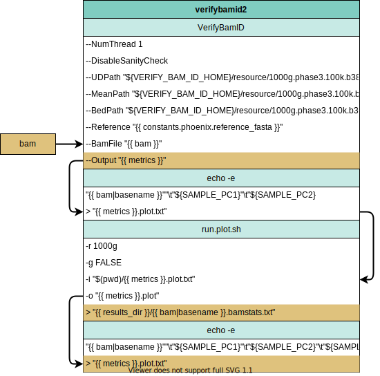

Sex Check
---------

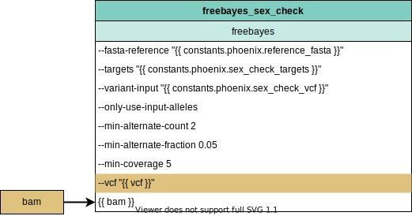

QC Exome
========

GATK CollectHSMetrics
---------------------

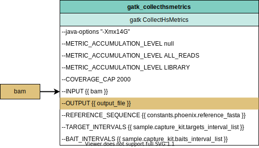

QC Genome
=========

GATK CollectWGSMetrics
----------------------

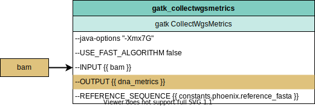

GATK CollectWGSMetricsWithNonZeroCoverage
-----------------------------------------

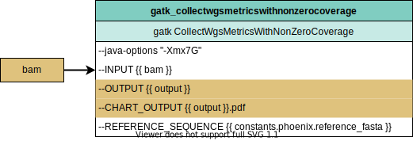

GATK CollectRawWGSMetrics
-------------------------

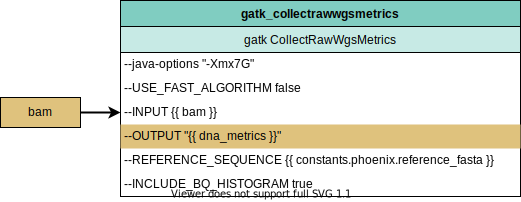

QC RNA
======

GATK CollectRnaSeqMetrics
-------------------------

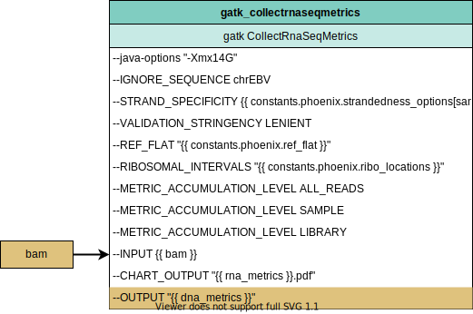

RNA BTcell Loci
---------------

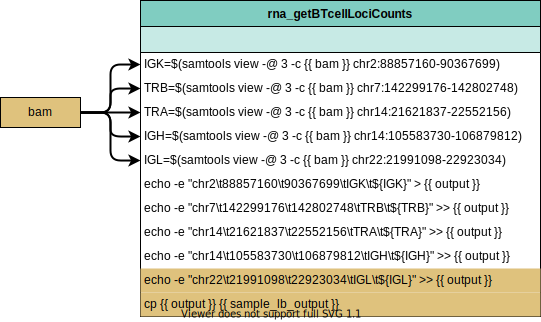

QC SnpSniffer
=============

SnpSniffer Summary
------------------

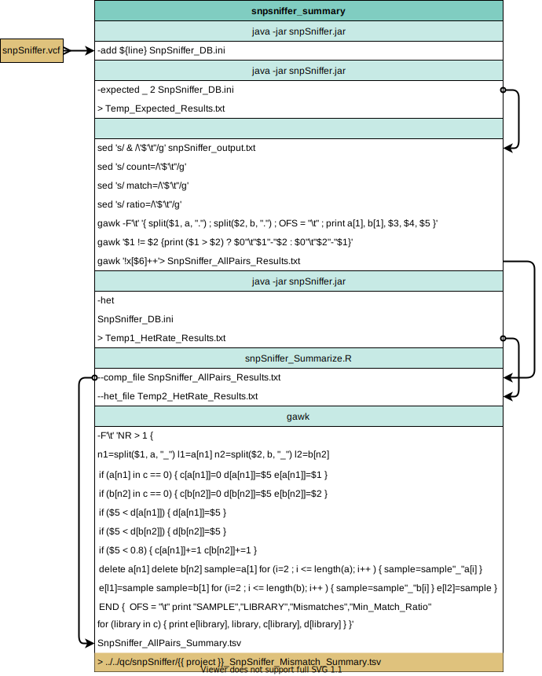

Stats Upload
============

Stats2JSON
----------

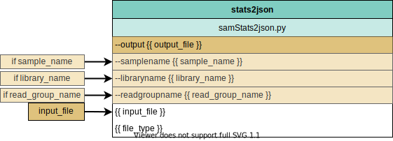

Stats2LIMS
----------

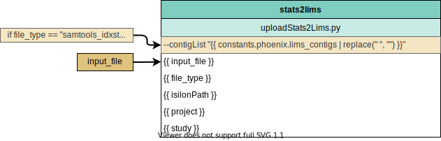